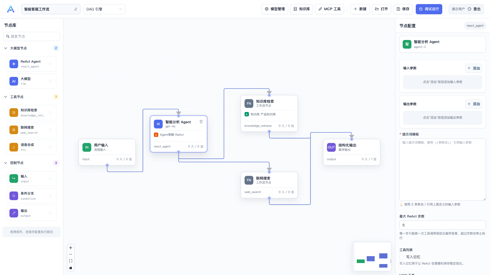
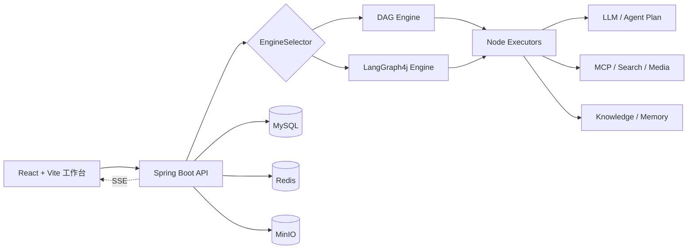

<div align="center">
  
  <h1>AgentFlow</h1>
  <p><strong>把模型、工具与知识连接成可运行的 AI 工作流</strong></p>
  <p>可视化编排 · 双执行引擎 · 实时调试 · 企业知识库 · MCP 工具</p>
</div>

---

AgentFlow 是一个面向开发者和 AI 应用团队的可视化 AI 工作流编排平台。它通过 DAG 与 LangGraph4j 双执行引擎连接大模型、Agent、知识库和工具，并提供从流程设计、配置管理到实时调试的统一工作空间。



> 当前界面：在同一画布中编排用户输入、ReAct Agent、知识库检索、联网搜索与结构化输出，并在右侧配置所选节点。

## 核心能力

- 可视化工作流：基于 React Flow 拖拽节点、连接依赖、配置输入与输出。
- 双执行引擎：DAG 适合确定性流程，LangGraph4j 支持复杂状态图和条件路由。
- 多模型接入：支持 OpenAI、DeepSeek、Qwen、智谱、AIPing 与火山方舟 Agent Plan。
- Agent 与工具：支持 ReAct、联网搜索、页面抓取、记忆读写、TTS、图片和视频生成。
- 企业知识库：文本导入、分片预览、向量索引、检索测试和工作流内召回。
- MCP 工具管理：集中配置、测试并复用外部 MCP 能力。
- 可观测执行：通过 SSE 推送节点状态、日志、输出和耗时，支持快照与断点续执行。
- 安全访问：JWT 访问令牌与刷新令牌、接口鉴权、敏感配置环境变量化。

## 产品架构



## 技术栈

| 层级 | 技术 |
| --- | --- |
| 前端 | React 18、TypeScript、Vite 6、React Flow、Ant Design 6、Tailwind CSS 4、Zustand |
| 后端 | Java 21、Spring Boot 3.4、Spring AI、LangGraph4j、MyBatis-Plus |
| 数据 | MySQL 8、Redis、MinIO |
| 鉴权 | JWT（Access Token + Refresh Token） |
| 接口 | REST、Server-Sent Events、OpenAPI |

## 快速开始

### 1. 环境要求

- JDK 21
- Node.js 18+ 与 npm 9+
- Maven 3.8+
- MySQL 8.0+
- Redis（使用记忆与执行状态能力时需要）
- MinIO（使用图片、视频等对象存储能力时需要）

### 2. 初始化数据库

```bash
mysql -u root -p < backend/src/main/resources/schema.sql
```

脚本会创建 `agentflow` 数据库、核心表和预置节点定义。

### 3. 配置环境变量

```bash
cp backend/.env.example backend/.env
cp frontend/.env.example frontend/.env.local
```

至少需要在 `backend/.env` 中设置：

```dotenv
MYSQL_PASSWORD=your_mysql_password
JWT_SECRET=replace_with_a_random_secret_of_at_least_32_characters
```

生产环境还应修改或禁用默认管理员账户，并为所需模型、Redis 和 MinIO 配置正式凭据。

### 4. 一键启动

```bash
chmod +x start.sh
./start.sh
```

脚本会在配置文件缺失时从示例创建本地配置、首次启动时安装前端依赖，并同时启动前后端服务。按 `Ctrl+C` 可一起停止两个服务。后端使用系统 Maven 启动。

启动后访问：

- Web 工作台：[http://localhost:5173](http://localhost:5173)
- Swagger UI：[http://localhost:8084/swagger-ui.html](http://localhost:8084/swagger-ui.html)

本地默认账户为 `admin / admin123`，仅用于开发环境。

### 分别启动

```bash
cd backend
mvn spring-boot:run
```

```bash
cd frontend
npm install
npm run dev
```

## 工作流如何运行

1. 在节点库中选择输入、模型、Agent、工具、控制或输出节点。
2. 将节点拖入画布并连接数据依赖。
3. 在右侧检查器配置模型、提示词、变量、知识库和工具。
4. 保存工作流并选择 DAG 或 LangGraph 引擎。
5. 打开调试面板输入测试数据，实时观察节点状态和最终输出。

## 项目结构

```text
AgentFlow/
├── backend/
│   └── src/main/java/com/agentflow/
│       ├── controller/       # REST 与 SSE 接口
│       ├── engine/           # DAG、LangGraph、节点执行器与技能系统
│       ├── service/          # 工作流、知识库、模型与工具服务
│       ├── mapper/           # MyBatis-Plus 数据访问
│       └── entity/           # 领域实体
├── frontend/
│   └── src/
│       ├── pages/            # 登录、编辑器、知识库、MCP 工具
│       ├── components/       # 画布、节点库、调试器、品牌组件
│       ├── store/            # Zustand 状态
│       └── api/              # HTTP API 客户端
├── docs/                     # 使用、架构和项目文档
├── design/                   # README 使用的当前界面截图
└── start.sh                  # 本地一键启动脚本
```

## 开发与验证

```bash
cd backend
mvn test
mvn clean package
```

```bash
cd frontend
npm run lint
npm run build
```

## 配置说明

| 变量 | 默认值 | 说明 |
| --- | --- | --- |
| `SERVER_PORT` | `8084` | 后端端口 |
| `MYSQL_DATABASE` | `agentflow` | 数据库名称 |
| `MYSQL_USERNAME` | `root` | 数据库用户 |
| `MYSQL_PASSWORD` | 无 | 数据库密码 |
| `JWT_SECRET` | 开发时临时生成 | 生产环境必须显式配置 |
| `APP_AUTH_DEFAULT_USERNAME` | `admin` | 默认管理员用户名，留空可禁用 |
| `APP_AUTH_DEFAULT_PASSWORD` | `admin123` | 默认管理员密码 |
| `VITE_API_BASE_URL` | `/api` | 前端 API 基地址 |
| `VITE_API_PROXY_TARGET` | `http://localhost:8084` | Vite 本地代理目标 |

完整变量见 [`backend/.env.example`](backend/.env.example) 与 [`frontend/.env.example`](frontend/.env.example)。

## 文档

- [使用指南](docs/USER_GUIDE.md)
- [后端说明](backend/README.md)
- [前端说明](frontend/README.md)
- [品牌与界面规范](docs/BRAND_GUIDE.md)
- [Agent Plan 与 Harness 集成计划](docs/agent-plan-harness-integration-plan.md)

## 安全提示

- 不要提交 `.env`、模型密钥、数据库密码或 JWT 密钥。
- 生产环境必须更换默认管理员账户并使用高强度 `JWT_SECRET`。
- 对外开放前应配置 HTTPS、限流、审计日志和最小权限网络策略。
- 工作流中的自定义代码、网页访问和 MCP 工具应在受控环境中运行。

## License

请在发布或分发前补充适合项目的许可证文件。
